<h1 align="center">Hi 👋, I'm Siddharth Maurya</h1>

<h3 align="center">
  Full-Stack Developer • AI Engineering • Cloud & DevOps
</h3>

  I build scalable full-stack web applications with the MERN stack and Next.js,
  and I'm expanding my expertise in AI engineering, cloud infrastructure, and DevOps.

  <b>🚀 Currently looking for full-time SDE / Full-Stack Developer opportunities</b>

---

<h2>🔗 Connect With Me</h2>

  
  &nbsp;
  
  &nbsp;
  

---

<h2>🛠️ Languages & Technologies</h2>

<h3>Languages</h3>

  
  
  
  
  
  

<h3>Frontend</h3>

  
  
  
  

<h3>Backend & Databases</h3>

  
  
  
  

<h3>DevOps & Tools</h3>

  
  
  

---

<h2>📌 Featured Projects</h2>

<table>
  <tr>
    <td width="50%" valign="top">

### 🏨 Bookmystay

A full-stack hotel booking platform designed to handle hotel discovery, bookings, payments, and image management.

**Tech Stack**

`React` · `Node.js` · `Express` · `MongoDB` · `TypeScript` · `Stripe` · `Cloudinary`

**Links**

<a href="https://bookmystay-5da5.onrender.com/" target="_blank">🔗 Live Demo</a>
&nbsp;•&nbsp;
<a href="https://github.com/MauryaSiddharth/Bookmystay" target="_blank">📂 Source Code</a>

  </td>

  <td width="50%" valign="top">

### 💬 Whisperbox

An anonymous feedback and messaging platform with AI-assisted message suggestions, built with a modern Next.js stack.

**Tech Stack**

`Next.js` · `TypeScript` · `MongoDB` · `Tailwind CSS` · `Gemini API`

**Links**

<a href="https://whisperbox-beryl.vercel.app/" target="_blank">🔗 Live Demo</a>
&nbsp;•&nbsp;
<a href="https://github.com/MauryaSiddharth/Whisperbox" target="_blank">📂 Source Code</a>

  </td>
  </tr>
</table>

---

<h2>🌱 Currently Learning</h2>

  <b>AI Engineering</b> — LLM applications, RAG pipelines, agentic workflows,
  and integrating AI capabilities into production full-stack applications.

  <b>Cloud & DevOps</b> — Docker, CI/CD, deployment workflows,
  and cloud infrastructure.

---

<h2>📊 GitHub Statistics</h2>

  
  

  

---

<h2>📫 Get In Touch</h2>

  📧 <a href="mailto:siddharthmaurya7451@gmail.com">siddharthmaurya7451@gmail.com</a>

  <b>💼 Open to full-time SDE / Full-Stack Developer opportunities</b>

  <i>Building. Learning. 🚀</i>

